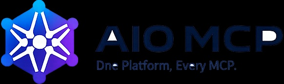
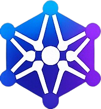

<div align="center">

<!-- Theme-adaptive banner -->
<picture>
  <source media="(prefers-color-scheme: dark)"  srcset="assets/banner-dark.jpg">
  <source media="(prefers-color-scheme: light)" srcset="assets/banner-ligth.jpg">
  
</picture>

<br/>
<br/>



# AIO MCP

### One Platform. Every MCP.

**The world's most advanced open-source platform for managing every Model Context Protocol server, plugin, AI provider, workflow, marketplace, registry, automation, and enterprise deployment.**

<br/>

[](https://github.com/CRTYPUBG/aio-mcp/actions/workflows/ci.yml)
[](LICENSE)
[](https://www.rust-lang.org)
[](https://railway.app)

<br/>

[🚀 Deploy to Railway](#railway-deployment) · [📖 Architecture](docs/architecture/phase-1.md) · [🔑 API Reference](#api-reference) · [🛠 Local Dev](#local-development)

</div>

---

## What is AIO MCP?

AIO MCP is a unified control plane and runtime for the full [Model Context Protocol](https://modelcontextprotocol.io) ecosystem.

Think of it as **Docker Desktop + VS Code Marketplace + npm** — built exclusively for MCP.

| Capability | Description |
|---|---|
| 🔌 **Plugin Manager** | Install, update, rollback MCP servers with one click |
| 🏪 **Marketplace** | Browse and publish MCP servers with ratings, reviews, and security scanning |
| 📦 **Registry** | Package index with signing, versioning, and delta updates |
| 🤖 **AI Provider Manager** | Route prompts across OpenAI, Anthropic, Gemini, Groq, Ollama, and more |
| âš¡ **Workflow Engine** | Visual automation builder with MCP and AI nodes |
| 🔐 **Security** | Zero Trust, RBAC, secret vault, sandboxing, supply chain protection |
| 📊 **Observability** | Logs, metrics, traces, health checks, alerts |
| 🌐 **REST API** | Full HTTP API with API key auth — deploy anywhere |
| 🖥 **Desktop App** | Cross-platform native interface (Windows, Linux, macOS) |
| 📟 **CLI** | Enterprise-grade `aio` command-line tool |

---

## Architecture

```
┌─────────────────────────────────────────────────────────┐
│                  Experience Layer                       │
│   Desktop App (Tauri)  │  Web Dashboard  │  CLI (Rust)  │
├─────────────────────────────────────────────────────────┤
│                    API Layer                            │
│        REST /v1/*     │  GraphQL  │  WebSocket          │
├─────────────────────────────────────────────────────────┤
│              Core Services (Rust + Tokio)               │
│  Engine │ Plugin Mgr │ Config │ Permissions │ Gateway   │
├─────────────────────────────────────────────────────────┤
│                    Data Layer                           │
│      SQLite / PostgreSQL    │   Redis   │    S3         │
└─────────────────────────────────────────────────────────┘
```

Core runtime — **Rust** (zero-cost, memory-safe, async).  
UX surfaces — **TypeScript + React**.  
Deployed as a single Docker container or a Rust binary.

---

## Railway Deployment

AIO MCP is a pure HTTP API — no frontend bundle, runs straight on Railway.

### 1. One-click deploy

[](https://railway.app/new/template?template=https://github.com/CRTYPUBG/aio-mcp)

### 2. Set environment variables

In the Railway dashboard → **Variables**:

| Variable | Value | Notes |
|---|---|---|
| `AIO_API_KEYS` | `sk-your-secret-key` | Comma-separate multiple keys |
| `PORT` | *(auto)* | Railway sets this automatically |
| `RUST_LOG` | `aio_server=info` | Optional |

Generate a strong key:
```bash
openssl rand -hex 32
```

### 3. Deploy via CLI

```bash
railway login
railway link    # link to your Railway project
railway up      # build with Dockerfile and deploy
```

---

## API Reference

All `/v1/*` endpoints require authentication. Public endpoints do not.

### Authentication

```
X-Api-Key: sk-your-key
# or
Authorization: Bearer sk-your-key
```

### Public endpoints

| Method | Path | Description |
|---|---|---|
| `GET` | `/` | Service info |
| `GET` | `/health` | Health check (used by Railway) |

### Plugins

| Method | Path | Description |
|---|---|---|
| `GET` | `/v1/plugins` | List registered plugins |
| `POST` | `/v1/plugins` | Register a plugin |

```bash
curl -X POST https://your-app.up.railway.app/v1/plugins \
  -H "X-Api-Key: sk-your-key" \
  -H "Content-Type: application/json" \
  -d '{"id": "official.github", "version": "1.0.0"}'
```

### Configuration

| Method | Path | Description |
|---|---|---|
| `GET` | `/v1/config/:scope/:key` | Get a config value |
| `PUT` | `/v1/config/:scope/:key` | Set a config value (optimistic lock) |

```bash
curl -X PUT https://your-app.up.railway.app/v1/config/workspace/theme \
  -H "X-Api-Key: sk-your-key" \
  -H "Content-Type: application/json" \
  -d '{"value": "dark", "expected_revision": 0}'
```

### Permissions

| Method | Path | Description |
|---|---|---|
| `POST` | `/v1/permissions/request` | Request a permission grant |
| `POST` | `/v1/permissions/grant` | Approve a permission request |
| `GET` | `/v1/permissions/check` | Check if a principal has access |

```bash
# 1. Request
curl -X POST https://your-app.up.railway.app/v1/permissions/request \
  -H "X-Api-Key: sk-your-key" \
  -d '{"principal_id": "user-1", "scope": "plugin.install"}'

# 2. Grant
curl -X POST https://your-app.up.railway.app/v1/permissions/grant \
  -H "X-Api-Key: sk-your-key" \
  -d '{"principal_id": "user-1", "scope": "plugin.install"}'

# 3. Verify
curl "https://your-app.up.railway.app/v1/permissions/check?principal_id=user-1&scope=plugin.install" \
  -H "X-Api-Key: sk-your-key"
```

### Platform

| Method | Path | Description |
|---|---|---|
| `GET` | `/v1/services` | Registered core services |
| `GET` | `/v1/routes` | Gateway route table |

---

## Local Development

### Prerequisites

- [Rust stable](https://rustup.rs)
- Node.js 20+ *(optional — for TypeScript apps)*

### Run the API server

```bash
git clone https://github.com/CRTYPUBG/aio-mcp.git
cd aio-mcp

# Configure env
cp .env.example .env
# Edit .env → set AIO_API_KEYS=sk-local-dev-key

# Start server
cargo run --package aio-server

# Verify
curl http://localhost:3000/health
curl http://localhost:3000/v1/plugins -H "X-Api-Key: sk-local-dev-key"
```


### Run tests

```bash
cargo test --workspace
```

### Full build (to dist/)

```powershell
powershell -ExecutionPolicy Bypass -File scripts/build.ps1
```

---

## Project Structure

```
aio-mcp/
├── server/                    # HTTP API server (Rust + axum)
├── core/
│   ├── engine/                # Service registry and event bus
│   ├── plugin-manager/        # Plugin lifecycle
│   ├── configuration-manager/ # Typed config with revision control
│   ├── permission-manager/    # RBAC grant lifecycle
│   └── api-gateway/           # Route table
├── apps/
│   ├── desktop/               # Desktop app shell (TypeScript)
│   ├── web-dashboard/         # Web dashboard shell (TypeScript)
│   └── cli/                   # CLI shell (TypeScript)
├── schemas/manifests/         # Plugin manifest JSON Schema
├── docs/architecture/         # Architecture docs and master prompt
├── scripts/                   # build.ps1, verify.ps1
├── assets/                    # Brand assets
├── Dockerfile                 # Multi-stage Docker build
└── railway.json               # Railway deployment config
```

---

## Roadmap

| Phase | Focus | Status |
|---|---|---|
| 1 | Core engine, plugin manager, config, permissions, API server | ✅ Complete |
| 2 | Domain events, manifest validator, transport manager | 🔄 In Progress |
| 3 | MCP connection manager (stdio + HTTP transport) | 📋 Planned |
| 4 | Marketplace search and install flow | 📋 Planned |
| 5 | Registry publish pipeline with signing | 📋 Planned |
| 6 | Workflow engine v1 (DAG, MCP + AI nodes) | 📋 Planned |
| 7 | AI Provider Manager (routing + fallback) | 📋 Planned |
| 8 | Desktop app core screens (Tauri + React) | 📋 Planned |
| 9 | Web dashboard enterprise modules | 📋 Planned |
| 10 | Security hardening and compliance | 📋 Planned |

---

## Technology Stack

| Layer | Technology |
|---|---|
| Core services | Rust, Tokio, Axum |
| Desktop app | Tauri, React, TypeScript |
| Web dashboard | React, TypeScript |
| CLI | Rust, Clap |
| Database | SQLite (local), PostgreSQL (cloud) |
| Cache | Redis |
| Observability | OpenTelemetry, Prometheus, Grafana |
| Deployment | Docker, Railway, Kubernetes |

---

## Contributing

Contributions are welcome. Please open an issue first to discuss major changes.

1. Fork the repository
2. Create a feature branch: `git checkout -b feat/my-feature`
3. Run tests: `cargo test --workspace`
4. Open a pull request

---

## License

MIT — see [LICENSE](LICENSE) for details.

---

<div align="center">

<br/>
<sub>Built with ❤️ for the MCP ecosystem</sub>
</div>
